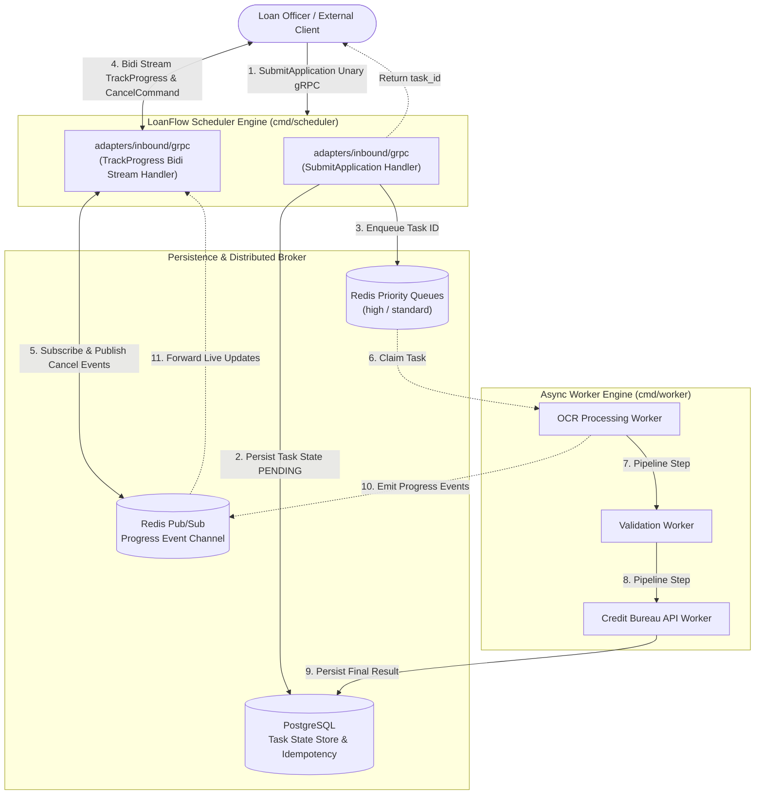

# PROJECT_SPECIFICATION.md

# LoanFlow: gRPC-Powered Reconciliation Engine & Async Task Scheduler
> **Architecture Specification & Implementation Roadmap**

## 1. Project Overview & Main Goal
**LoanFlow** is an enterprise-grade, asynchronous document processing pipeline and task scheduling system designed for high-volume loan applications (PDF bank statements, payslips, ID scans). 

### Core Objectives:
1. **Async Submission & Non-Blocking API:** Accept loan applications instantly via a Unary gRPC call, enforce unique application idempotency, and immediately return a `task_id` without blocking on heavy OCR or credit bureau processing.
2. **Real-Time Bidirectional Progress Tracking & Control:** Establish a gRPC bidirectional stream (`TrackProgress`) to push live incremental updates (e.g., OCR stage, Credit Bureau validation) while simultaneously allowing client-side mid-flight job cancellation.
3. **Priority Queueing & Load Shedding:** Enforce strict job priority (high-value loans processed via fast lanes) using Redis worker pools, rejecting incoming traffic gracefully with `RESOURCE_EXHAUSTED` (gRPC Status Code 8) during extreme load spikes.
4. **Context Cancellation Propagation:** Propagate client cancellation signals seamlessly through Go contexts down to Redis Pub/Sub, worker goroutines, and active DB/HTTP clients to prevent double-billing external third-party APIs.
5. **REST Gateway Interoperability:** Expose OpenAPI/Swagger specs and REST endpoints alongside native gRPC using `grpc-gateway`.

---

## 2. Technical Stack & Engineering Constraints

| Category | Technology | Rationale |
| :--- | :--- | :--- |
| **Language** | **Go (1.21+)** | High-performance concurrency, channels, native context cancellation. |
| **Transport Protocol** | **gRPC / HTTP/2** (gRPC-Gateway for REST fallback) | Multiplexed bidi streaming, strongly typed Protobuf schemas, binary efficiency. |
| **Schema Toolchain** | **Buf (`buf.build`)** & **`protovalidate`** | Linting, breaking change protection, and declarative runtime field validation. |
| **Task Queue & Pub/Sub** | **Redis** | Priority list queueing (`high` / `standard`) and lightweight pub/sub event distribution. |
| **Persistence & State Store** | **PostgreSQL** | ACID-compliant task state management, audit logging, and idempotency constraints. |
| **Observability** | **OpenTelemetry + Jaeger / Prometheus** | Distributed tracing across gRPC handlers, Redis queues, and worker execution. |
| **Configuration** | **`envconfig`** | 12-factor application configuration with environment variables and defaults. |
| **Testing Strategy** | **`testing` + `uber-go/mock`** | Table-driven tests (`t.Run`), generated port/repository mocks, no global state. |

---

## 3. Architecture & Data Flow Diagram



---

## 4. Repository Folder Structure

```text
loanflow/
├── PROJECT_SPECIFICATION.md   # System memory & architecture specification document
├── buf.yaml                   # Buf Protobuf toolchain configuration
├── buf.gen.yaml               # Code generation setup (Go, gRPC, Gateway, OpenAPI)
├── docker-compose.yaml        # Local environment (PostgreSQL, Redis, Jaeger)
├── Makefile                   # Build, test, proto gen, and dev commands
├── go.mod
├── go.sum
│
├── api/                       # Protobuf Contract Definitions
│   └── loanflow/
│       └── v1/
│           └── loanflow.proto
│
├── cmd/                       # Dual Microservice Entrypoints
│   ├── scheduler/             # Binary 1: gRPC + REST Gateway API Server
│   │   └── main.go
│   └── worker/                # Binary 2: Async Worker Pool (OCR, Credit Bureau)
│       └── main.go
│
└── internal/                  # Private Application Logic (Hexagonal Architecture)
    ├── domain/                # PURE GO DOMAIN
    │   ├── task.go        # Task state, progress events, and cancellation models
    │   └── loan.go        # Loan application payload validation entities
    │
    ├── ports/                 # Contract Interfaces (Driven & Driving)
    │   ├── inbound/           # Primary Ports
    │   │   ├── submit_loan.go
    │   │   └── track_progress.go
    │   └── outbound/          # Secondary Ports
    │       ├── task_repo.go   # PostgreSQL persistence interface
    │       ├── queue.go       # Redis queue broker interface
    │       └── pubsub.go      # Redis pub/sub streaming interface
    │
    └── adapters/              # Concrete Infrastructure Implementations
        ├── inbound/           # Driving Adapters
        │   ├── grpc/          # gRPC Server & Bidi Stream Handlers
        │   └── rest/          # gRPC-Gateway REST proxy handlers
        │
        └── outbound/          # Driven Adapters
            ├── postgres/      # PostgreSQL repository implementation
            ├── redis/         # Redis queue and Pub/Sub adapter
            └── external/      # Mock OCR engine and Credit Bureau REST clients

```

---

## 5. Implementation Roadmap & GitHub Project Tracking

The implementation is divided into **4 sequential execution phases**. Each phase maps directly to a feature branch and GitHub Project board epic.

### 🚩 Phase 1: Protobuf Contracts & Toolchain Setup (`feature/phase-1-contracts`)

* [ ] Initialize Go module and project directory layout.
* [ ] Configure `buf.yaml` and `buf.gen.yaml` (including gRPC-Gateway & protovalidate).
* [ ] Define `api/loanflow/v1/loanflow.proto` (Unary `SubmitApplication`, Bidi Stream `TrackProgress`, `CancelCommand`).
* [ ] Generate Go gRPC code and REST reverse-proxy stubs using `buf generate`.

### 🚩 Phase 2: Domain Core, Ports & Unit Tests (`feature/phase-2-domain-core`)

* [ ] Implement pure Go domain models (`internal/domain/model/task.go`, `loan.go`).
* [ ] Implement domain state machine transitions (`PENDING` -> `PROCESSING` -> `COMPLETED`/`CANCELLED`/`FAILED`).
* [ ] Define Inbound and Outbound Port interfaces under `internal/ports/`.
* [ ] Write 100% pure Go table-driven unit tests for domain state logic using `t.Run()`.
* [ ] Generate interface mocks using `uber-go/mock`.

### 3. Phase 3: Infrastructure Adapters (Postgres, Redis, Workers) (`feature/phase-3-adapters`)

* [ ] Build PostgreSQL schema migration script (task store, idempotency indexes).
* [ ] Implement PostgreSQL Outbound Adapter (`adapters/outbound/postgres`).
* [ ] Implement Redis Priority Queue and Pub/Sub Outbound Adapters (`adapters/outbound/redis`).
* [ ] Implement Worker Pool Engine (`cmd/worker`) with `context.WithCancel` cancellation listeners.

### 🚩 Phase 4: gRPC/REST Handlers & Local Orchestration (`feature/phase-4-grpc-orchestration`)

* [ ] Implement gRPC Unary handler for application submission with load-shedding rate limits.
* [ ] Implement gRPC Bidi Streaming handler for progress updates and live `CancelCommand` triggers.
* [ ] Mount gRPC-Gateway REST proxy server.
* [ ] Build `docker-compose.yaml` (Postgres, Redis, Jaeger) and perform end-to-end load testing with `ghz`.


