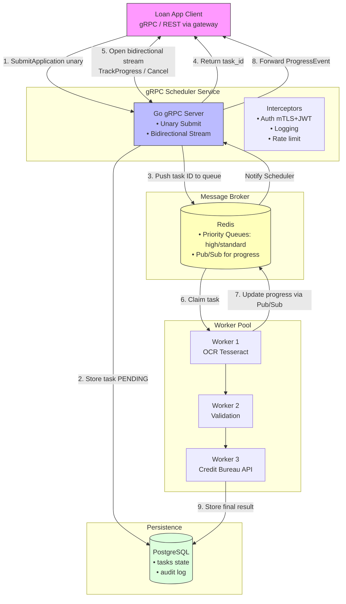

# 📄 LoanFlow – gRPC Document Processing Pipeline

[](https://goreportcard.com/report/github.com/yourusername/loanflow)
[](https://buf.build)
[](https://opensource.org/licenses/MIT)

**Bidirectional gRPC streaming + task scheduler** for a lending platform that processes loan documents asynchronously with real-time progress, cancellation, and observability.

> Built to solve: *“How do we process 10,000+ loan applications daily without HTTP timeouts, while giving loan officers live feedback and the ability to cancel stuck jobs?”*

---

## 📌 The Problem (Business Context)

A fintech lending platform receives loan applications containing PDF bank statements, payslips, and ID scans. Their legacy **synchronous REST pipeline** suffers from:

| Issue | Business impact |
|-------|----------------|
| ❌ **60s timeout** – long‑running OCR & credit bureau calls get dropped | Lost applications & unhappy customers |
| ❌ **No progress visibility** – “is it stuck or still working?” | Wasted underwriter time |
| ❌ **No cancellation** – duplicate submission can’t stop an ongoing expensive API call | Paying twice for the same credit check |
| ❌ **No load shedding** – Monday morning spike crashes the service | Reputation loss & SLA breach |

**Business goal:** Process 500 concurrent loan apps with **p99 < 90s**, provide **real‑time status updates**, and reduce timeout errors by **>90%**.

---

## 🚀 How We Solve It – gRPC Async Task Scheduler

We built a **distributed task system** using **gRPC bidirectional streaming** + **Redis broker** + **PostgreSQL state store**.  

Key design decisions:

1. **Async submission** – Client gets a `task_id` immediately → no blocking.
2. **Bidirectional stream** – Server pushes incremental progress (`OCR page 5/20`, `calling Credit Bureau`). Client can **cancel** mid‑stream.
3. **Worker pool with priorities** – High‑value loans (>500k) go to a fast lane (Redis priority queue).
4. **Idempotency** – Same `application_id` won’t be processed twice.
5. **Observability** – OpenTelemetry traces show exactly where time is spent (OCR, external API, DB).
6. **Graceful degradation** – When overloaded, server rejects new tasks with `RESOURCE_EXHAUSTED` (gRPC status code 8).

---

## 🧱 Architecture



**Data flow:**

1. **Submit** – scheduler validates proto, stores task state `PENDING` in Postgres, pushes task ID to Redis queue → returns `task_id`.
2. **Stream** – client opens a `TrackProgress` stream. Server subscribes to Redis pub/sub for that task ID and forwards every progress event.
3. **Cancel** – client sends `CancelCommand` on the same stream → server cancels the context → worker receives cancellation and aborts.
4. **Worker** – claims task from Redis, updates progress to Postgres & publishes events to Redis Pub/Sub.

All gRPC calls are secured with **mTLS** + JWT (auth interceptor).

---

## ✨ Best Practices & Patterns Shown

| Pattern | Implementation |
|---------|----------------|
| **Bidirectional streaming** | Real‑time progress + cancellation over a single channel |
| **Interceptors** | Logging, auth, recovery, rate‑limiting (all chained) |
| **Graceful shutdown** | `grpc.Server.GracefulStop()` + wait for pending streams to finish |
| **Context propagation** | From client `context.WithCancel` → server → worker → DB calls |
| **Idempotency** | DB unique constraint on `application_id`; return existing `task_id` on duplicate |
| **Backpressure** | Semaphore-limited worker pool; reject when full (`codes.ResourceExhausted`) |
| **Observability** | OpenTelemetry spans for each RPC, queue dequeue, external call |
| **Configuration** | `envconfig` + default values; no hardcoded secrets |
| **Testing** | Table‑driven unit tests + in‑memory gRPC server mock + integration test with testcontainers |

---

## 🛠 Tech Stack

- **Language:** Go 1.21+  
- **gRPC:** `google.golang.org/grpc` v1.60+  
- **Protocol Buffers:** `buf` for linting & breaking change detection, `protovalidate` for runtime validation  
- **Gateway:** `grpc-gateway` v2 (REST + Swagger UI)  
- **Message Broker:** Redis (for task queue + pub/sub)  
- **Database:** PostgreSQL (task state, audit log)  
- **Observability:** OpenTelemetry → Jaeger (traces), Prometheus (metrics)  
- **Deployment:** Docker + Kubernetes (gRPC load balancing via headless service)  
- **CI/CD:** GitHub Actions – `buf lint`, unit tests, integration tests, Docker build, push to GHCR

---

## 📦 Getting Started (local development)

### Prerequisites
- Go 1.21+, Docker (Postgres & Redis)
- `buf` CLI – [install](https://buf.build/docs/installation)
- `protoc-gen-go`, `protoc-gen-go-grpc`, `protoc-gen-grpc-gateway`

### 1. Clone & generate proto
```bash
git clone https://github.com/yourusername/loanflow
cd loanflow
make proto   # runs buf generate
